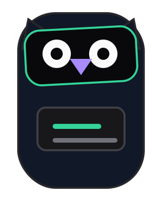

# 片语 · Video Lens

<p align="center">
  
</p>

<p align="center">
  一个运行在 Bilibili 和 YouTube 视频页面的智能摘要 Userscript。
</p>

<p align="center">
  <a href="https://github.com/KarlZhu-ZXC/video-lens/stargazers"></a>
  <a href="https://github.com/KarlZhu-ZXC/video-lens/blob/main/LICENSE"></a>
  <a href="https://github.com/KarlZhu-ZXC/video-lens"></a>
</p>

Video Lens 自动读取视频信息和字幕，通过 OpenAI-compatible 文本模型生成流式摘要，并支持基于视频内容继续追问和生成配图。

## 功能

- 支持 Bilibili 视频页面和 YouTube `watch` / `shorts` 页面。
- 自动读取视频信息、公开字幕及可用的翻译字幕。
- 使用 OpenAI-compatible API 生成流式 Markdown 摘要。
- 支持长字幕分段摘要与合并。
- 支持基于摘要和字幕的连续对话。
- 展示模型 reasoning 过程与思考耗时。
- 支持 API 生图，以及实验性的 ChatGPT 网页生图。
- 提供中英文界面、字幕/摘要语言选择和自动摘要开关。
- 支持摘要复制、Markdown 导出、重新生成和本地缓存管理。
- 面板使用 Shadow DOM 隔离页面样式，支持拖拽调整宽度。

## 安装

### 环境要求

- [Tampermonkey](https://www.tampermonkey.net/)
- [Node.js](https://nodejs.org/)
- [pnpm](https://pnpm.io/)

### 本地构建

```bash
git clone https://github.com/KarlZhu-ZXC/video-lens.git
cd video-lens
pnpm install
pnpm build
```

构建完成后，将 `dist/video-lens.user.js` 安装到 Tampermonkey。打开支持的视频页面，点击页面上的 Video Lens 悬浮入口即可使用。

## 配置

首次使用时，在设置中填写文本模型的 `Base URL`、`API Key` 和模型名称，然后进行连通性测试。文本模型和图片模型独立配置。

YouTube 默认使用页面字幕，必要时通过同源 `youtubei/v1/player` 读取；也可在设置中填写 YouTube 官方 API 凭证作为备用元数据来源。

### ChatGPT 网页生图（实验）

1. 在 ChatGPT 中新建一个专用 Project。
2. 在图片设置中选择“ChatGPT 网页生图”，填入 Project 根页的完整 URL。
3. 保持该 Project 根页打开，完成连通性测试后即可从视频摘要中发起生图。

该功能依赖 ChatGPT 页面结构，页面更新后可能需要同步适配。

## 开发

```bash
# 监听源码变更并重新构建
pnpm dev

# 启动 UI harness
pnpm dev:harness

# 运行测试
pnpm test

# 类型检查并构建
pnpm build
```

UI harness 默认运行在 `http://127.0.0.1:5173/harness.html`。

## 支持项目

觉得 Video Lens 有帮助，可以给项目点一个 [Star](https://github.com/KarlZhu-ZXC/video-lens/stargazers)，或通过 [PayPal](https://paypal.me/xczhu) 请作者喝杯咖啡。

<a href="https://paypal.me/xczhu"></a>

## Star History

<a href="https://www.star-history.com/#KarlZhu-ZXC/video-lens&Date">
  <picture>
    <source media="(prefers-color-scheme: dark)" srcset="https://api.star-history.com/svg?repos=KarlZhu-ZXC/video-lens&type=Date&theme=dark">
    <source media="(prefers-color-scheme: light)" srcset="https://api.star-history.com/svg?repos=KarlZhu-ZXC/video-lens&type=Date">
    
  </picture>
</a>

## 许可证

本项目基于 [MIT License](./LICENSE) 开源。
